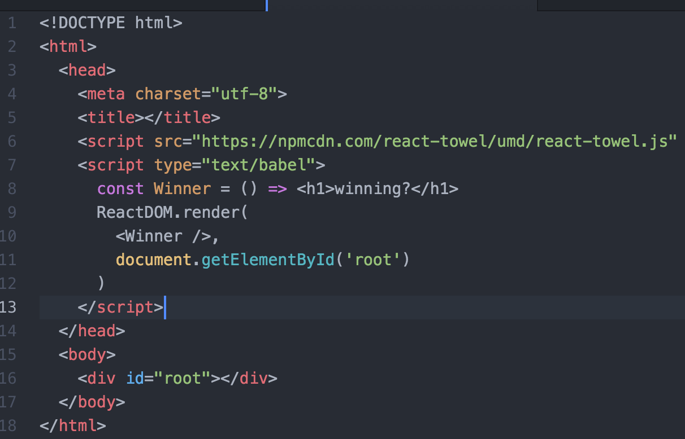

# React Towel

Rapid React Prototyping

React Towel brings together babel-standalone, react, react-dom, and throw-in-the-towel to make it dead simple to start using React with JSX and ES6.

1. Include this script in your html page
2. Write es6 scripts in `` tags
3. View the page
5. Profit?

Checkout an example by viewing the source for: [react-towel.surge.sh](http://react-towel.surge.sh)

